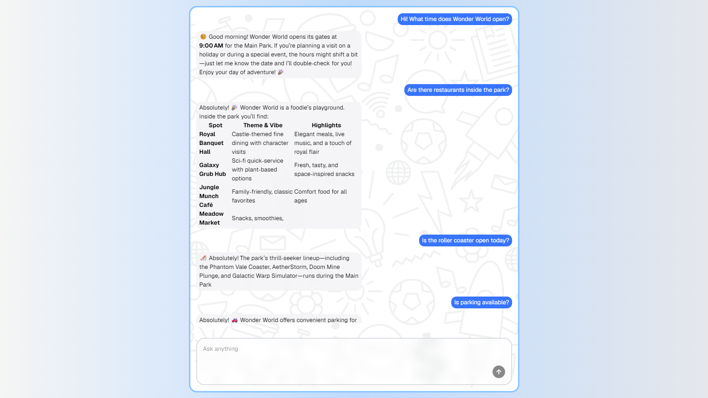

# Wonder World AI Customer Support Chatbot

An AI-powered customer support chatbot for **Wonder World Theme Park**. The chatbot provides helpful park information and answers customer questions in a cheerful and friendly tone.

Built with **React**, **TypeScript**, **Tailwind CSS**, **Bun**, and a **REST API**, using the `openai/gpt-oss-20b:free` model.

## Live Demo

🌐 **[View the deployed application](https://ai-chatbot-client-five.vercel.app)**

## Screenshot



## Chatbot Behavior

The chatbot is designed to:

* Answer questions related only to **Wonder World Theme Park**
* Provide information based on available park details
* Maintain a cheerful and customer-friendly tone
* Avoid making up information when details are unavailable
* Politely redirect unrelated questions

## Tech Stack

### Client

* React
* TypeScript
* Vite
* Tailwind CSS
* Axios

### Server

* Bun
* TypeScript
* Express
* REST API
* OpenAI SDK

## Project Structure

```text
.
├── packages/
│   ├── client/          # React + Vite frontend
│   └── server/          # Bun + Express REST API
├── assets/
│   └── wonder-world-chatbot.png
├── package.json
└── README.md
```

## Features

* AI-powered Wonder World customer support
* Theme park information assistance
* Conversation-based chat
* RESTful API
* Responsive user interface
* Separate client and server applications
* Environment-based configuration

## Getting Started

### Prerequisites

* Bun
* Node.js

### Install Dependencies

```bash
bun install
```

### Configure Environment Variables

Create a `.env` file inside `packages/server`:

```env
OPENROUTER_API_KEY=your_api_key
```

Create a `.env` file inside `packages/client`:

```env
VITE_API_BASE_URL=http://localhost:3000
```

### Run the Application

Start the server:

```bash
cd packages/server
bun run dev
```

Start the client in a new terminal:

```bash
cd packages/client
bun run dev
```

Open the application at:

```text
http://localhost:5173
```

## API

### Send a Chat Message

```http
POST /api/chat
```

Request body:

```json
{
  "prompt": "What are the park opening hours?",
  "conversationId": "unique-conversation-id"
}
```

Response:

```json
{
  "message": "Welcome to Wonder World! 🎢 How can I help you today?"
}
```

## AI Model

```text
openai/gpt-oss-20b:free
```

## License

This project is available for learning and development purposes.
